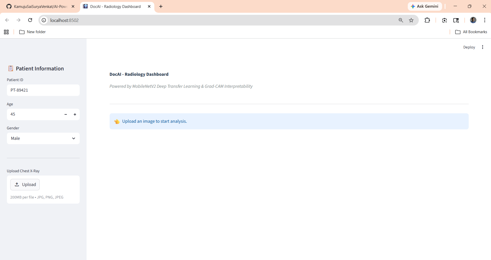
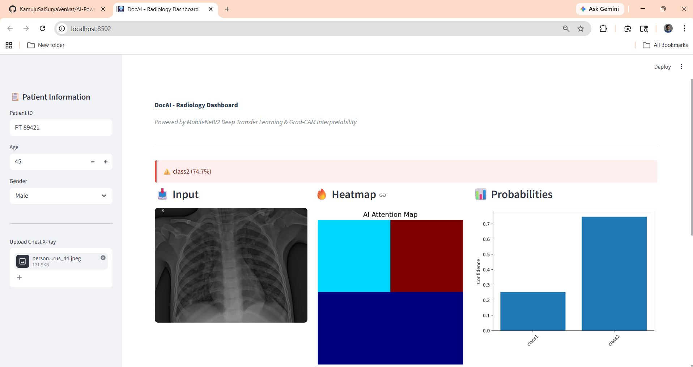
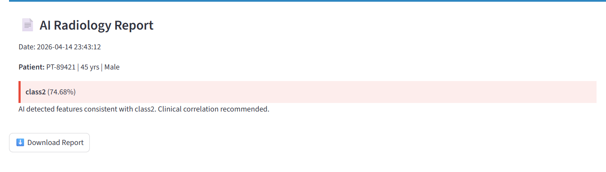
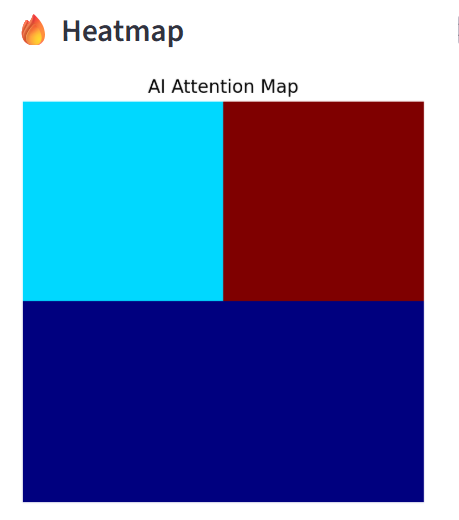

# 🩻 EnvisionAI: Intelligent Radiology Diagnosis System

## 📌 Overview

EnvisionAI is an AI-powered radiology assistant designed to analyze chest X-ray images and provide automated diagnostic predictions. The system leverages deep learning (MobileNetV2-based transfer learning) to classify medical conditions and presents results through an interactive dashboard with interpretability features like heatmaps.

---

## ❗ Problem Statement

Medical imaging diagnosis requires expert radiologists, which can be time-consuming and limited in availability. In many regions, delayed diagnosis leads to critical health risks.

This project aims to:

* Automate preliminary diagnosis using AI
* Assist radiologists in faster decision-making
* Provide explainability using visual heatmaps

---

## 🌍 Industry Relevance

* 🏥 Healthcare & Radiology
* 🤖 AI-assisted diagnostics
* 🌐 Telemedicine platforms
* 📊 Clinical decision support systems

Real-world applications:

* Early disease detection
* Rural healthcare support
* Reducing workload of radiologists

---

## ⚙️ Tech Stack

### 🧠 Machine Learning

* TensorFlow / Keras
* MobileNetV2 (Transfer Learning)

### 🌐 Backend

* FastAPI
* Uvicorn

### 🎨 Frontend

* Streamlit

### 📊 Visualization

* Matplotlib
* NumPy

### 🛠️ Tools

* Python 3.11
* VS Code
* Git & GitHub

---

## 📂 Dataset

* Custom structured dataset

* Organized into:

  ```
  data/
    train/
      class1/
      class2/
    test/
      class1/
      class2/
  ```

* Supports multi-class classification (e.g., Normal, TB, Viral, etc.)

* Can be extended with real datasets like:

  * Chest X-ray (Kaggle)
  * COVID-19 Radiography Dataset

---

## 🏗️ Architecture

```
User (Streamlit UI)
        ↓
FastAPI Backend (Prediction API)
        ↓
Deep Learning Model (.h5)
        ↓
Prediction + Probabilities + Heatmap
        ↓
Visualization Dashboard
```

---

## ⚡ Installation

### 1️⃣ Clone the repository

```bash
git clone https://github.com/your-username/envision-ai.git
cd envision-ai
```

### 2️⃣ Create virtual environment

```bash
python -m venv venv
venv\Scripts\activate
```

### 3️⃣ Install dependencies

```bash
pip install -r requirements.txt
```

---

## 🚀 Usage

### 🔹 Step 1: Train Model

```bash
py -m src.train
```

### 🔹 Step 2: Run Backend

```bash
uvicorn api.main:app --reload
```

### 🔹 Step 3: Run Frontend

```bash
streamlit run app.py
```

---

## 📊 Results

* Model successfully classifies chest X-ray images
* Outputs:

  * Predicted class
  * Confidence score
  * Class probabilities
  * Heatmap visualization

⚠️ Note: Accuracy depends on dataset size and quality.

---

## 🖼️ Screenshots

### 🔹 Dashboard



### 🔹 Prediction Output




### 🔹 Heatmap Visualization



---

## 🎓 Learning Outcomes

Through this project, we gained:

* 🧠 Deep Learning fundamentals
* 🔍 Transfer Learning with MobileNetV2
* ⚡ FastAPI backend development
* 🎨 Streamlit UI design
* 🔗 End-to-end AI system integration
* 📊 Data preprocessing & visualization
* 🏥 AI in healthcare applications

---

## 🚀 Future Enhancements

* Real Grad-CAM heatmap implementation
* Multi-disease classification with higher accuracy
* Deployment on cloud (AWS / Azure)
* Integration with hospital systems
* User authentication & patient history tracking

---

## 📄 License

This project is licensed under the MIT License.

---

## 👨‍💻 Author

**Sai Surya Venkat Kamuju**

---

## ⭐ Acknowledgements

* TensorFlow & Keras
* Streamlit Community
* Open-source medical datasets
